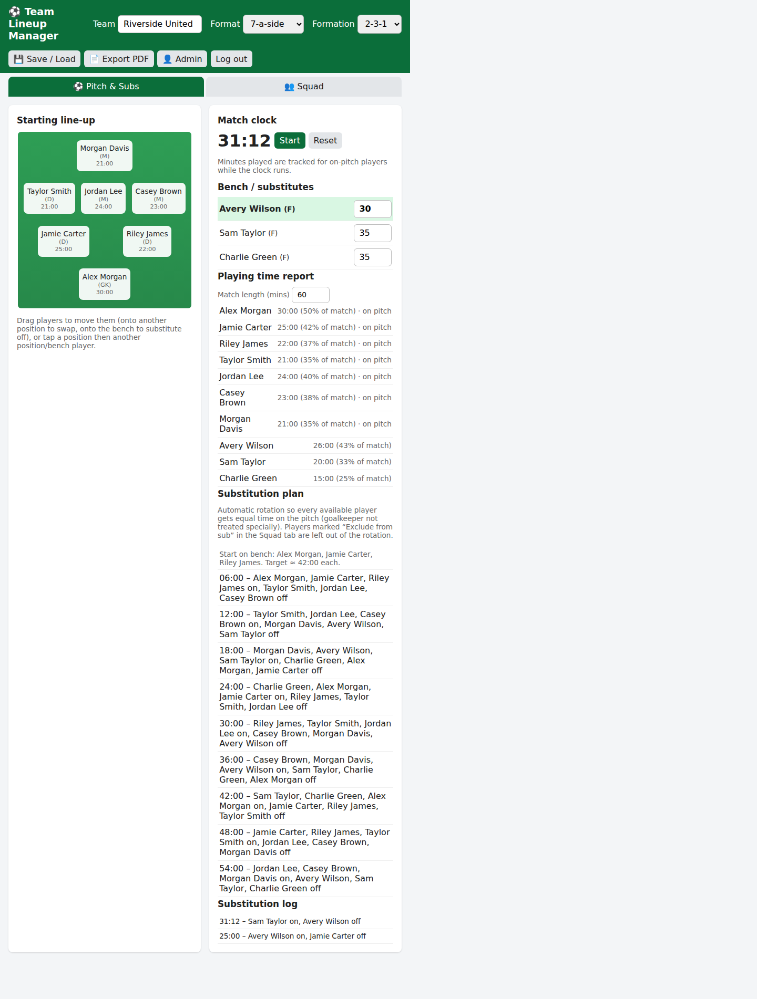
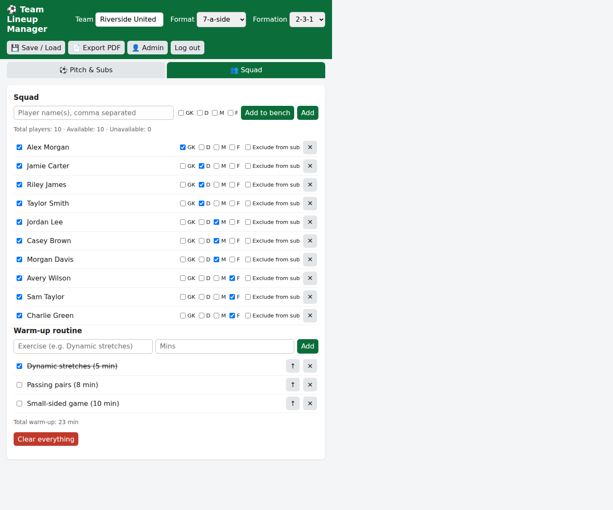

# FootballLineup

A lightweight, browser-based tool for planning football team line-ups and managing match-day substitutions. The app is a single HTML file with no build step or external dependencies.

## Screenshots

### Pitch and match management



### Squad and warm-up



Screenshots use fictional sample players and team data.

## Getting started

1. Clone or download this repository.
2. Serve the repository over `localhost` or HTTPS. For example:

   ```sh
   python3 -m http.server 8000
   ```

3. Open `http://localhost:8000` in your browser.
4. On first launch, create an administrator account. The password must be at least eight characters.

## Using the app

- **Set up a squad:** Add one or more players, mark their preferred positions, and set player availability in the **Squad** tab.
- **Arrange a line-up:** Choose a team format and formation. Drag players between pitch positions or the bench, or select a player and then a destination to swap them.
- **Manage a match:** Start the match clock to track playing time. Enter the match length to see a playing-time report and an automatic, equal-time substitution plan. Set an individual bench player's planned entry time if needed.
- **Plan a warm-up:** Add timed exercises, mark them complete, and reorder the routine.
- **Save and share:** Save line-ups in the browser, optionally set a default line-up, and import or export saved plans as JSON. Export the current or a saved line-up as a PDF.
- **Manage accounts:** An administrator can create users, reset passwords, and remove accounts from the Admin panel.

## Data and privacy

Line-ups, saved plans, account records, and match history are stored in the browser's local storage; session information is stored in browser storage as well. Data is local to that browser and origin and is not synchronized to a server. Export plans regularly if you need a backup or want to move them to another browser.
